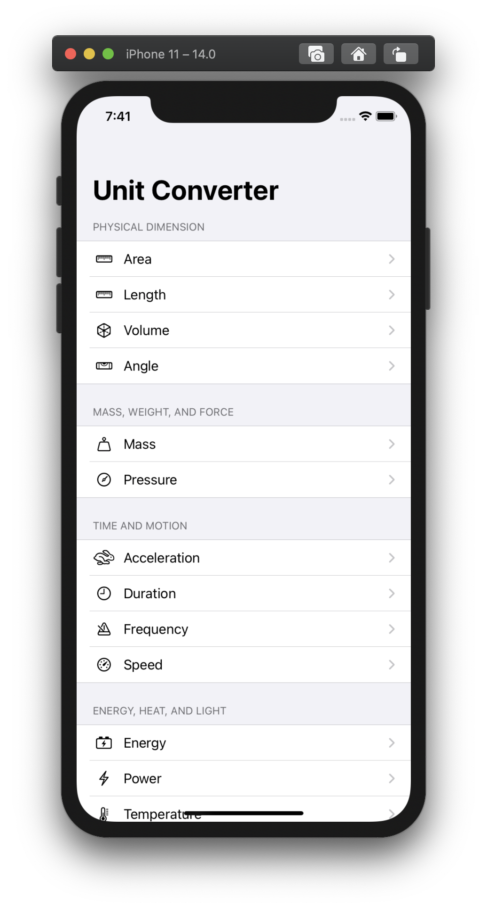
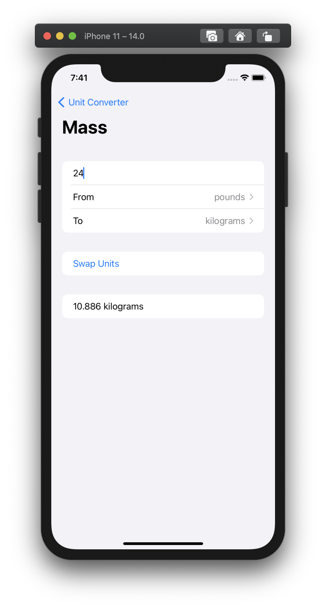

## Unit Converter

A fun little app for converting units of measurement I made for [Day 19](https://www.hackingwithswift.com/100/swiftui/19) of [100 Days of SwiftUI](https://www.hackingwithswift.com/100/swiftui). I'm pretty proud of how generic I was able to make [UnitConversionView.swift](UnitConverter/UnitConversionView.swift), and I enjoyed finding a use case to try out Foundation's Units and Measurement API.

## Screenshots

|         Main          |          Detail           |
|:---------------------:|:-------------------------:|
|  |  |

## Tech/framework used

* SwiftUI
* Apple Foundation's [Units and Measurement](https://developer.apple.com/documentation/foundation/units_and_measurement) APIs

## License

* MIT